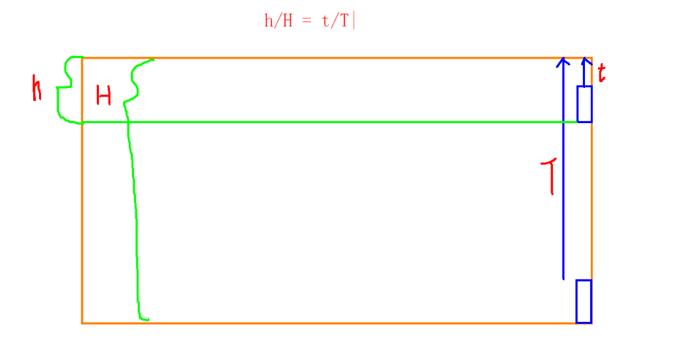
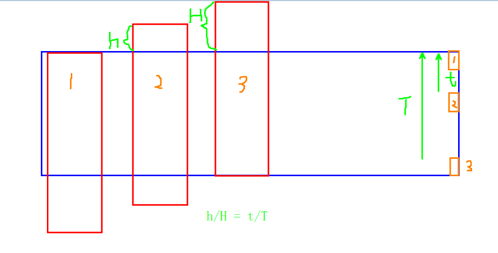
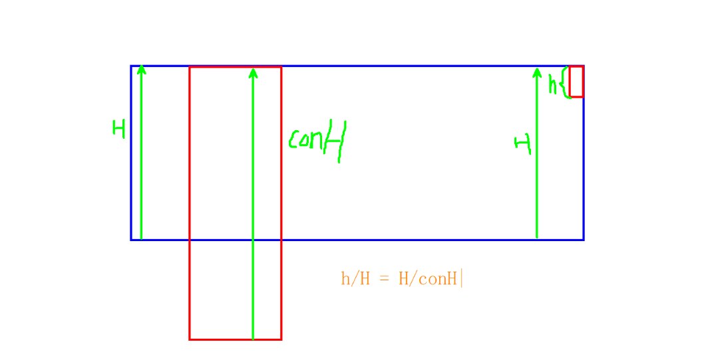

# 自定义滚动条

## 1 自定义滚动条思路图例

###  自定义滚动条窗帘版 内容高度随滚动条变化



### 自定义滚动条内容版 内容区域位置随滚动条变化




### 自定义滚动条高度 滚动条高度受内容区域影响




## 2. 比例计算

```
// 滑块高度的比例系数
sliderScale = 视口高度 / 内容高度 = 滑块高度 / 视口高度

// 内容位置的比例系数
scale = 内容位置 / (内容高度 - 视口高度) = 滑块位置 / (视口高度 - 滑块高度)

内容位置 = 滑块位置 * (内容高度 - 视口高度) / (视口高度 - 滑块高度)
内容位置 = 滑块位置 / ((视口高度 - 滑块高度) / (内容高度 - 视口高度))
内容位置 = 滑块位置 / sliderScale;
```

```
vH: 视口高度
cH: 内容高度
sH: 滑块高度
cT: 内容位置
sT: 滑块位置


sliderScale = vH / cH = sH / vH
cT = ST / ((vH - sH) / (cH - vH))

推导：
(vH - sH) / (cH - vH) = vH / cH = sH / vH = sliderScale

所以
cT = ST / sliderScale
内容位置 = 滑块位置 / sliderScale;

```

```
数学证明：
a / b = c / d = k

a = b * k
c = d * k

a - c = b * k - d * k
a - c = (b - d) * k
(a - c) / (b - d) = k;
```


## 3 滚轮事件

	ie/chrome : onmousewheel(dom0)
			event.wheelDelta
				上：120
				下：-120
			
	firefox : DOMMouseScroll 必须用(dom2的标准模式)
			event.detail
				上：-3
				下：3


​		
	return false阻止的是  dom0 所触发的默认行为
	dom2 需要通过event下面的event.preventDefault();
